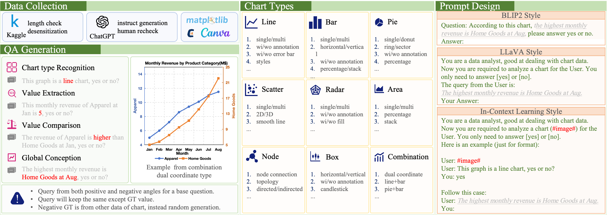
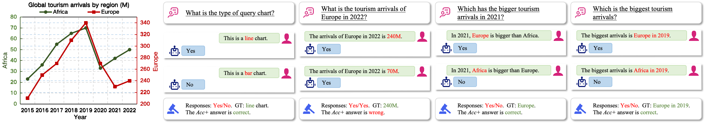
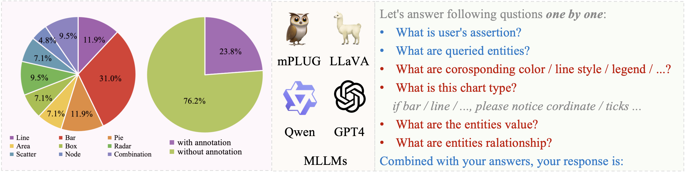
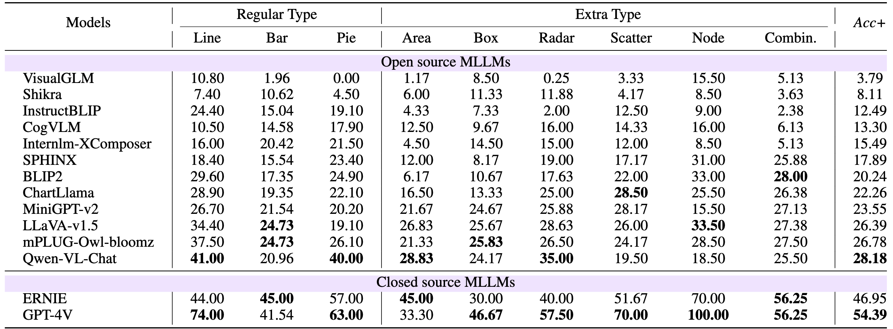

# ChartBench: A Benchmark for Complex Visual Reasoning in Charts

<a href='https://arxiv.org/abs/2312.15915'></a> <a href='https://github.com/'></a> <a href='https://github.com/buaacyw/GaussianEditor/blob/master/LICENSE.txt'></a> [](https://huggingface.co/datasets/SincereX/ChartBench-Demo)


## Introduction

We propose the challenging ChartBench to evaluate the chart recognition of MLLMs. 


We improve the *Acc+* metric to avoid the randomly guessing situations.


We collect a larger set of unlabeled charts to emphasize the MLLM's ability to interpret visual information without the aid of annotated data points.



## Todo
- [ ] Open source all data of ChartBench.
- [x] Open source demo of ChartBench (10%).
- [x] Open source the evaluate scripts.
- [x] Open source the inference scripts.
- [x] Open source the demo data.

## Setup
Please follow the official repository instructions below to set up the local environment.

-  <a href='https://huggingface.co/spaces/Salesforce/BLIP2'></a>
-  <a href='https://huggingface.co/docs/transformers/model_doc/instructblip'></a>
-  <a href='https://github.com/THUDM/CogVLM'></a>
-  <a href='https://github.com/QwenLM/Qwen-VL'></a>
-  <a href='https://llava-vl.github.io/'></a>
-  <a href='https://github.com/Vision-CAIR/MiniGPT-4'></a>
-  <a href='https://github.com/THUDM/VisualGLM-6B'></a>
-  <a href='https://github.com/X-PLUG/mPLUG-Owl'></a>
-  <a href='https://github.com/InternLM/InternLM-XComposer'></a>
-  <a href='https://github.com/shikras/shikra'></a>
-  <a href='https://github.com/Alpha-VLLM/LLaMA2-Accessory/tree/main/SPHINX'></a>
-  <a href='https://huggingface.co/listen2you002/ChartLlama-13b'></a>


## Inference
1. Complete the basic environment setup.
2. Set `task_name` in `./Repos/myprompt.py`, such as `test` or `BLIP2_Style`.
3. Select or set the desired system prompt in `./Repos/myprompt.py`.
4. Modify the default path of `CKPT_PATH` in `./Repos/{MODEL_NAME}/run.py`.
5. Run `run.py` following the command format in `./Scripts/inference.sh`.
6. The results are saved by default in `./Eval/{task_name}/{MODEL_NAME}`.
7. Set the parameters in `./Scripts/stat_acc_plus.py` and the statistical results are saved in `./Eval/{task_name}/Eval_Result`.

## Ranking





## Citation

```bib
@article{ChartBench,
    title={ChartBench: A Benchmark for Complex Visual Reasoning in Charts},
    author={Zhengzhuo Xu and Sinan Du and Yiyan Qi and Chengjin Xu and Chun Yuan and Jian Guo},
    journal={ArXiv},
    year={2023},
    volume={abs/2312.15915},
    url={https://api.semanticscholar.org/CorpusID:266550948}
}
```