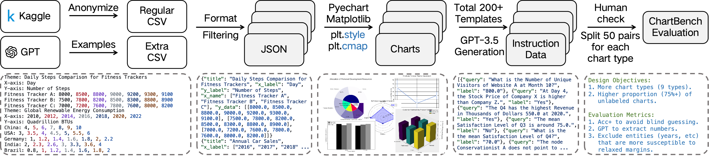
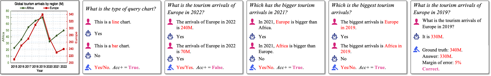
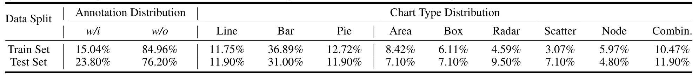

# ChartBench: A Benchmark for Complex Visual Reasoning in Charts

<a href='https://arxiv.org/abs/2312.15915'></a> <a href='https://github.com/'></a> <a href='https://github.com/buaacyw/GaussianEditor/blob/master/LICENSE.txt'></a> [](https://huggingface.co/datasets/SincereX/ChartBench)


## Introduction

We propose the challenging ChartBench to evaluate the chart recognition of MLLMs.




We improve the *Acc+* metric to avoid the randomly guessing situations.



We collect a larger set of unlabeled charts to emphasize the MLLM's ability to interpret visual information without the aid of annotated data points.




## Todo
- [ ] Open source: all evaluation results.
- [x] Open source: all data of ChartBench.
- [x] Open source: the evaluate scripts.
- [x] Open source: the inference scripts.
- [x] Open source: the demo data (10%).

## Setup
Please follow the official repository instructions below to set up the local environment.

<a href='https://huggingface.co/spaces/Salesforce/BLIP2'></a>
<a href='https://huggingface.co/docs/transformers/model_doc/instructblip'></a>
<a href='https://github.com/THUDM/CogVLM'></a>
<a href='https://github.com/QwenLM/Qwen-VL'></a>
<a href='https://llava-vl.github.io/'></a>
<a href='https://github.com/Vision-CAIR/MiniGPT-4'></a>
<a href='https://github.com/THUDM/VisualGLM-6B'></a>
<a href='https://github.com/X-PLUG/mPLUG-Owl'></a>
<a href='https://github.com/InternLM/InternLM-XComposer'></a>
<a href='https://github.com/shikras/shikra'></a>
<a href='https://github.com/Alpha-VLLM/LLaMA2-Accessory/tree/main/SPHINX'></a>
<a href='https://huggingface.co/listen2you002/ChartLlama-13b'></a>
<a href='https://github.com/UniModal4Reasoning/ChartVLM'></a>
<a href='https://github.com/THUDM/CogVLM'></a>
<a href='https://github.com/InternLM/InternLM-XComposer'></a>
<a href='https://mini-gemini.github.io/'></a>
<a href='https://github.com/X-PLUG/mPLUG-DocOwl/tree/main/DocOwl1.5'></a>
<a href='https://github.com/LingyvKong/OneChart'></a>


## Inference
1. Complete the basic environment setups
2. Set prompt style for both *Acc+* and *NQA* tasks in `./Repos/utils.py`
3. Modify the default path of `CKPT_PATH` in `./Repos/{MODEL_NAME}/infer.py`
4. Reimplement the `load_model` and `model_gen` functions
5. The results are saved in `./Result/raw/{MODEL_NAME}.jsonl` by default
6. Prompt LLMs in `./Stat/gpt_filter.py` to extract number values in NQA task
7. Set the parameters in `./Stat/stat_all_metric.py` and the statistical results are saved in `./Stat/Paper_Table`

## Ranking


## Citation

```bib
@article{ChartBench,
    title={ChartBench: A Benchmark for Complex Visual Reasoning in Charts},
    author={Zhengzhuo Xu and Sinan Du and Yiyan Qi and Chengjin Xu and Chun Yuan and Jian Guo},
    journal={ArXiv},
    year={2023},
    volume={abs/2312.15915},
    url={https://api.semanticscholar.org/CorpusID:266550948}
}
```